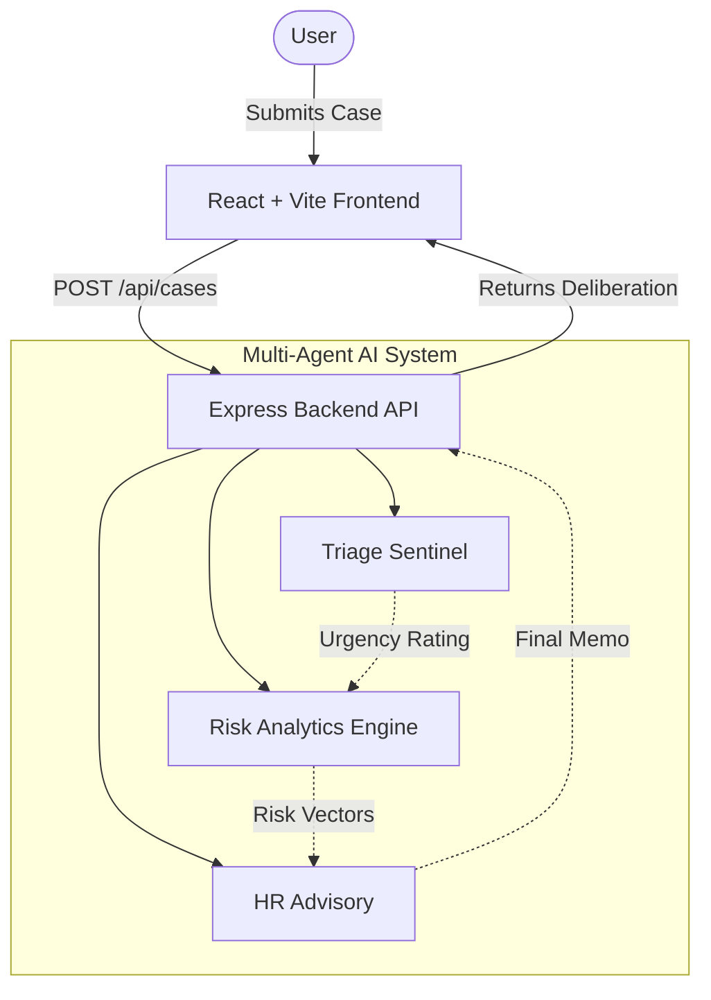

# Haven

Haven is an intelligent, multi-agent AI system designed to streamline and automate workplace case management. Acting as a digital advisory board for HR and management teams, Haven orchestrates specialized AI agents to triage employee incidents, assess psychosocial and compliance risks, and compile actionable advisory memos in real-time.

## Features

- **Multi-Agent AI Processing**: Automatically triages incoming cases using simulated intelligence agents (Triage Sentinel, Risk Analytics Engine, HR Advisory).
- **Dynamic Live Dashboard**: Real-time aggregation of active cases, severity distributions, and a custom Psychosocial Risk Profile matrix.
- **Dedicated Workflow Views**:
  - *Active Cases*: comprehensive list of all current incidents.
  - *Sign-off Queue*: A filtered pipeline for cases awaiting management approval.
  - *Agent Room*: A live feed interface to monitor AI deliberation.
- **System Diagnostics**: Built-in panel to monitor system metrics (API latency, agent memory, db connections) and real-time logs.
- **Premium Light Theme**: Clean, responsive, enterprise-grade UI built with pure CSS and React Router.
- **Serverless Ready**: Out-of-the-box support for Vercel deployment with Express backend integration.

## Architecture

Haven is a full-stack application optimized for serverless deployment on Vercel. It seamlessly serves a static frontend while routing API requests to an Express serverless function.



## Tech Stack

- **Frontend:** React 19, Vite, Vanilla CSS (with modern, premium styling), Lucide React, React Router DOM
- **Backend:** Node.js, Express, TypeScript
- **AI Integration:** Google GenAI / Custom Mock Agent Pipeline
- **Deployment:** Vercel (using `vercel.json` rewrites and `esbuild` for serverless function compilation)

## Project Layout

```
haven-app/
├── api/                  # Compiled output of server.ts for Vercel serverless
├── dist/                 # Compiled Vite frontend static assets
├── src/                  # React Frontend Source Code
│   ├── components/       # Reusable UI components (DiagnosticsPanel, etc.)
│   ├── layouts/          # Page wrappers (DashboardLayout)
│   ├── pages/            # Routable pages (Dashboard, Login, NewIntake, etc.)
│   ├── App.tsx           # Main application routing
│   └── index.css         # Global styles and design system variables
├── server.ts             # Express backend entry point and API routes
├── vercel.json           # Vercel deployment configuration & API rewrites
├── package.json          # Project metadata and build scripts
└── vite.config.ts        # Vite build configuration
```

## Getting Started

### Prerequisites
- Node.js (v18 or newer recommended)
- Git
- Vercel CLI (optional, for deploying locally via `npx vercel`)

### Environment Variables

If you wish to configure the application locally, you can create a `.env` file in the root directory. Currently, the system uses an in-memory database and mock agents, but for future integrations you may define:

```env
PORT=3000
GEMINI_API_KEY=your_google_gemini_key_here
MONGODB_URI=your_mongodb_connection_string
```

### Installation
1. Clone the repository:
   ```bash
   git clone https://github.com/anushkagupta200615-jpg/Haven.git
   cd Haven
   ```
2. Install dependencies:
   ```bash
   npm install
   ```

### Running Locally
To start both the Vite development server and the Express backend simultaneously:
```bash
npm run dev
```
The application will be running at `http://localhost:3000`.

### Production Build
To build the static frontend and bundle the backend for Vercel:
```bash
npm run build
```

## Deployment
Haven is ready to be deployed on Vercel. Simply import the repository in your Vercel dashboard. The `vercel.json` file is pre-configured to route API requests to the compiled Express serverless function while serving the Vite app via the Vercel edge CDN.
