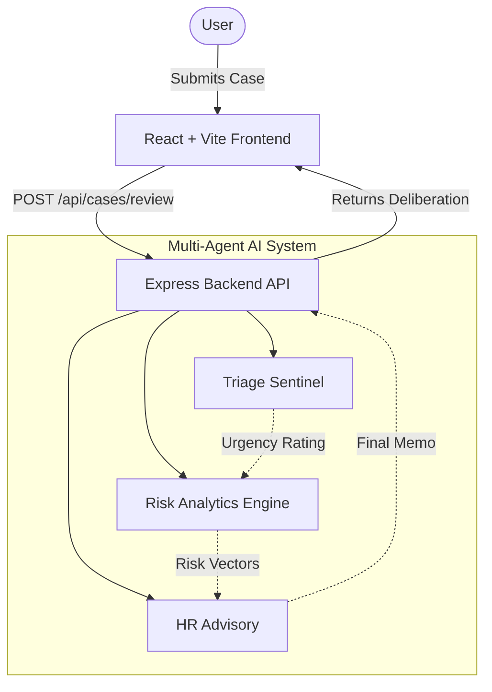

# Haven

Haven is an intelligent, multi-agent AI system designed to streamline and automate workplace case management. Acting as a digital advisory board for HR and management teams, Haven orchestrates specialized AI agents to triage employee incidents, assess psychosocial and compliance risks, and compile actionable advisory memos in real-time.

## Architecture

Haven is a full-stack application optimized for serverless deployment on Vercel. It seamlessly serves a static frontend while routing API requests to an Express serverless function.



## Tech Stack

- **Frontend:** React 19, Vite, Vanilla CSS (with modern, premium styling), Lucide React
- **Backend:** Node.js, Express, TypeScript
- **AI Integration:** Google GenAI / Custom Mock Agent Pipeline
- **Deployment:** Vercel (using `vercel.json` rewrites and `esbuild` for serverless function compilation)

## Getting Started

### Prerequisites
- Node.js (v18 or newer recommended)

### Installation
1. Clone the repository:
   ```bash
   git clone https://github.com/anushkagupta200615-jpg/Haven.git
   cd Haven
   ```
2. Install dependencies:
   ```bash
   npm install
   ```

### Running Locally
To start both the Vite development server and the Express backend simultaneously:
```bash
npm run dev
```
The application will be running at `http://localhost:3000`.

### Production Build
To build the static frontend and bundle the backend for Vercel:
```bash
npm run build
```

## Deployment
Haven is ready to be deployed on Vercel. Simply import the repository in your Vercel dashboard. The `vercel.json` file is pre-configured to route API requests to the compiled Express serverless function while serving the Vite app via the Vercel edge CDN.
